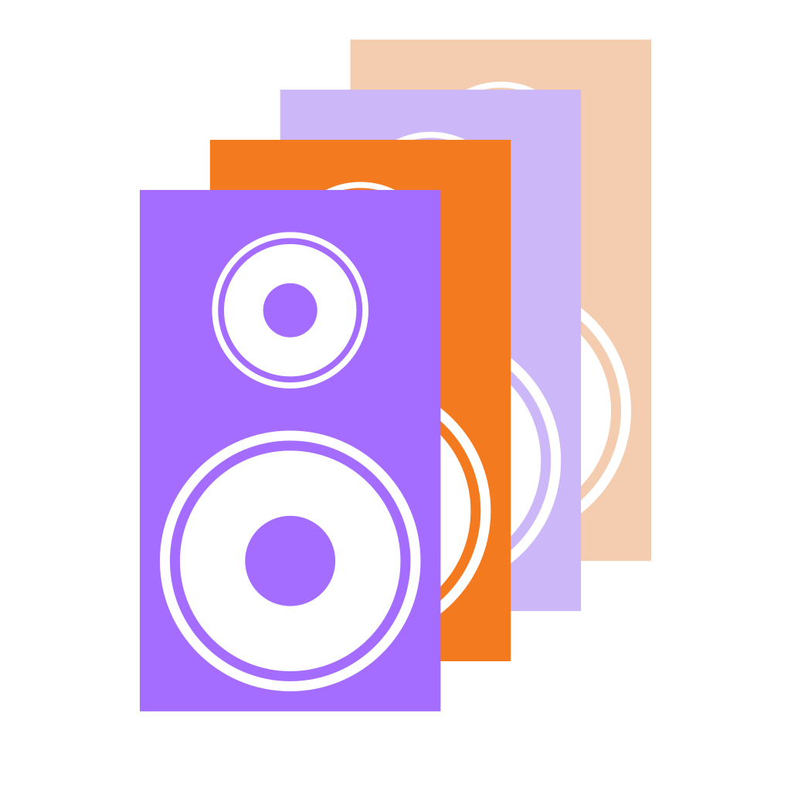

# Example

The following example shows the (not too high) level of complexity we want to master.

## Description

The example is a simple logo that consist of four speakers:
* all speakers are geometrically identical, but have different colors
* the speakers are made of a box with two vertically stacked drivers, the upper being a shrinked version of the lower one.
* the four speakers are arranged diagonally behind one another

## Structure

~~~
 ├── defs
 │      ├── driver
 │      ├── box
 │      └── speaker
 │             ├── use box
 │             ├── use driver
 │             └── use driver
 └── stack
        ├── use speaker
        ├── use speaker
        ├── use speaker
        └── use speaker
~~~

## Example Picture

To see the source code, move to the [testdata directory](../tests/testdata) and click on `logo.svg` and then on *Code*. Sorry, Github doesn't offer a way to integrate a link into a `md` file that renders an `.svg` as code and not as picture.

## Example programs

To see how to use this library, have a look at the [examples directory](/examples). All example scripts are also run when you run [run-tests.sh](../run-tests.sh) in the root directory of this repo.
